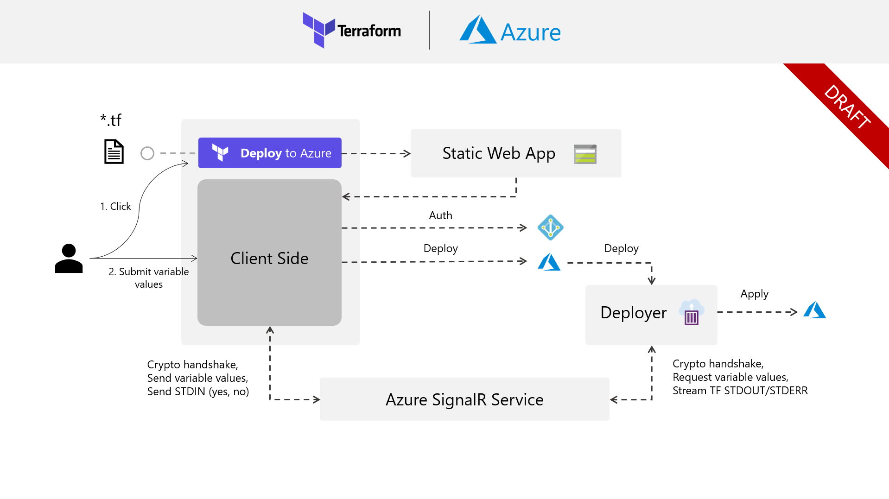

# Terraform Deploy to Azure

> This repository is currently under development, please be patient. If you have any feedback, proposals or general comments please open a new issue.

Azure has a great feature feature called 'Deploy to Azure' that allows you to simply click on an embedded button such as the one below:

This will allow you to take a Azure Resoure Manager (ARM) template and push it straight into Azure. Once you've clicked the button, a website will prompt you to input any required paramters for the given template and will then execute the template deployment. This is a frictionless way to allow your users to get up and running with your Azure resources. We want to replicate this experience but with Terraform Plans rather than ARM templates.

## Proposal
Below is our draft proposal for how to build this system. We want it to be as simple and intuitive as possible for the user.

