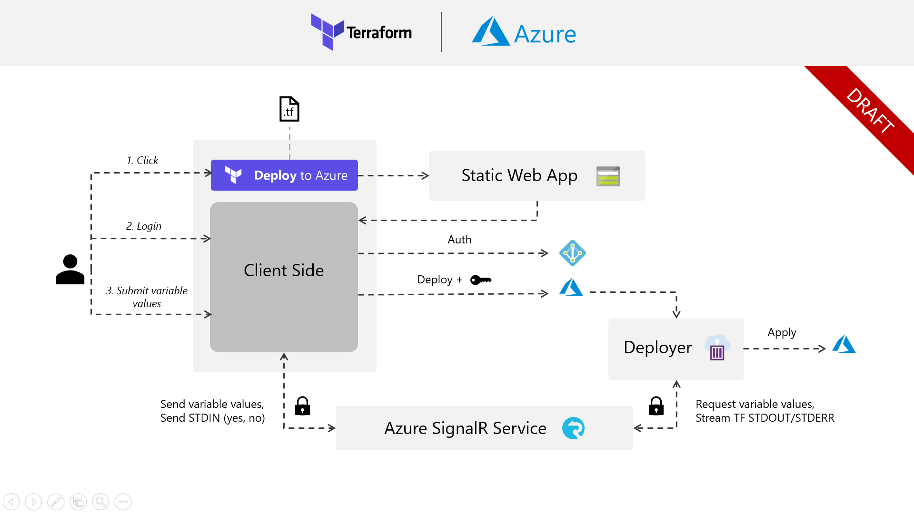
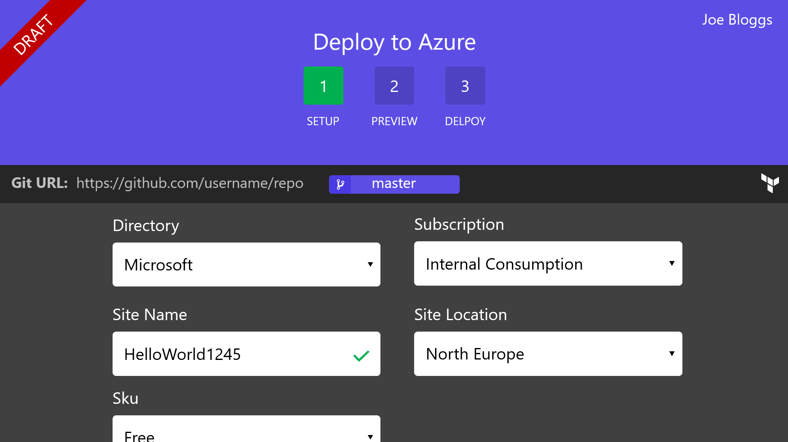

# Terraform Deploy to Azure

> This repository is currently under development, please be patient. If you have any feedback, proposals or general comments please open a new issue.

Azure has a great feature feature called 'Deploy to Azure' that allows you to simply click on an embedded button such as the one below:

This will allow you to take a Azure Resoure Manager (ARM) template and push it straight into Azure. Once you've clicked the button, a website will prompt you to input any required paramters for the given template and will then execute the template deployment. This is a frictionless way to allow your users to get up and running with your Azure resources. We want to replicate this experience but with Terraform Plans rather than ARM templates.

## Proposal
Below is our draft proposal for how to build this system. We want it to be as simple and intuitive as possible for the user.

## Screens
These screen assume the authentication process has been completed and you're now logged in as Joe Bloggs.

### Setup Screen
This page will display the user with a form to input any variables that are needed by their Terraform template. Any default values will already be placeholder in the associated field. Sanitization and validation will run asynchronously against each input field. Once the user has provided all the required fields, they will be able to progress to the next screen.

### Preview Screen
This screen will display a log of the Terraform plan that has been executed with the user's provided variable values. Once the preview is complete, the user will be prompted to input either `yes` or `no` to progress to the next screen. There will be a toggle that allows users to tail the log as it is streamed or stop to inspect a fixed point. Any errors surfaced will be shown here and will prompt a return back to the previous setup screen.

### Deploy Screen
The deploy screen will tail a log of the Terraform apply as it deploys the generated plan. This will give the user real time feedback on the progression of their deployment and any errors.
